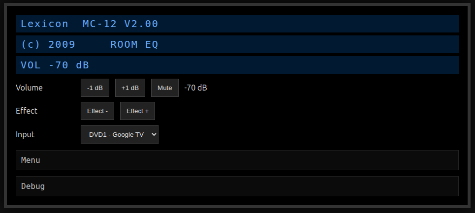
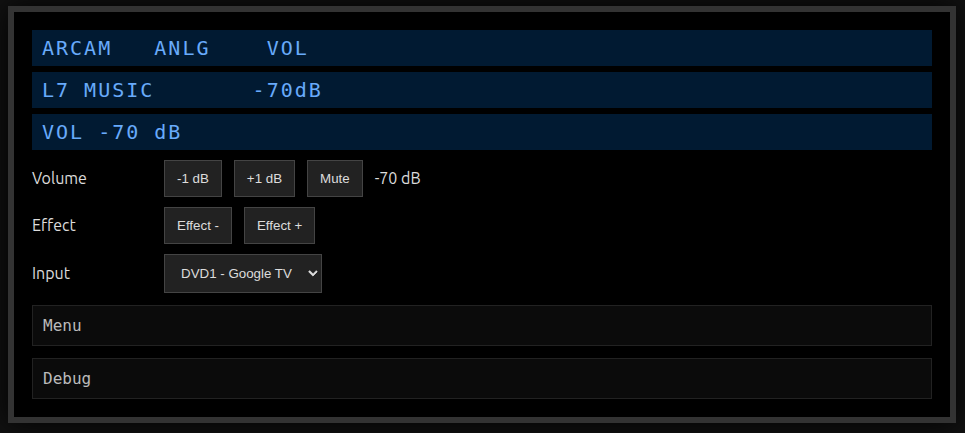
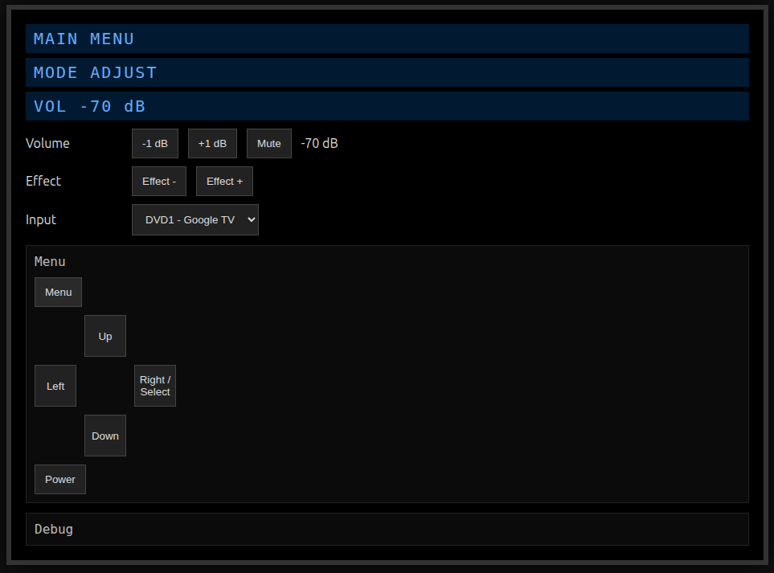
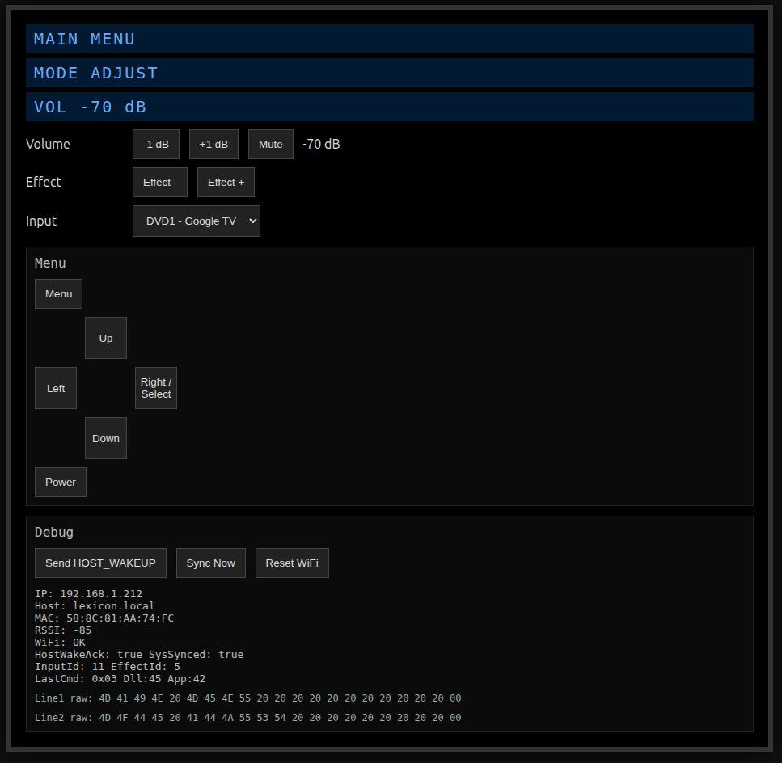
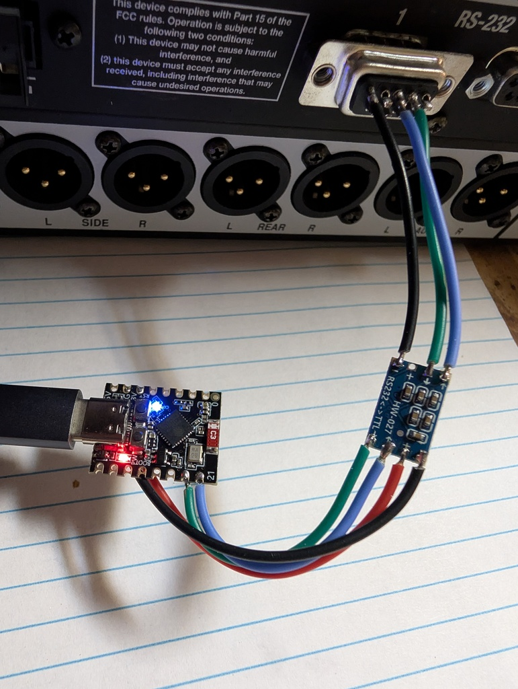

#lexicon-mc12-control

This is a small ESP32 project that connects to a Lexicon MC-12HD serial
port and in addition to displaying the unit's front panel information, 
allows minimal control of the unit functions.

This uses a commonly-available ESP32-C3 mini, RS232 to TTL converter
and DE9 male plug.  It is powered via the ESP32 USB-C port.

[ESP32-C3 -- amazon.com/dp/B0D1FX3QGN](https://www.amazon.com/dp/B0D1FX3QGN)

[RS232 to TTL converter -- amazon.com/dp/B00LUDCAXQ](https://www.amazon.com/dp/B00LUDCAXQ)

This has only been tested on an Lexicon MC12-HD.  The code is currently
modified slightly in the input drop-down for the external hardware on my
Lexicon.  I have not tested it on any other models.

There are two fold out menus - for the menu config to set unit parameters
and also for debugging information.  Both can be ignored under normal use.

This uses the tzapu/WiFiManager library to handle the WiFi / SSID setup.
On initial startup, the unit has a "Lexicon" SSID with ip address of
192.168.4.1 - a modern Android phone on initial connection will typically
automatically connect and send you to the UI for connecting to your own
home access point.  The blue LED turns on when WiFi is connected.  The
red LED is power.

After connection the unit uses mDNS and on a correctly connected network,
your web browser -may- find it at [http://lexicon.local](http://lexicon.local) .

Additional debugging output is available on the ESP32 serial port, 115200
baud - which includes MAC address, IP address, etc.

Unit startup.  The Menu pull out has a 'power' button that provides
the ability to turn the unit on, but not off.

Un-expanded menus during normal operation.  Here I have the Input
drop-down menus customized for both the front label and what I have
connected.

Expanded menu for unit setup.

All menus expanded including debugging output.  The "Reset WiFi" button
reset the unit entirely and prompts you to connect to a new AP.

The unpackaged unit - ESP32-C3 and level converter.
